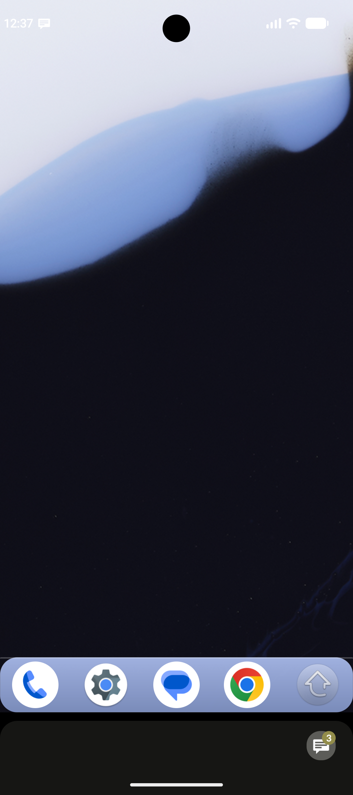
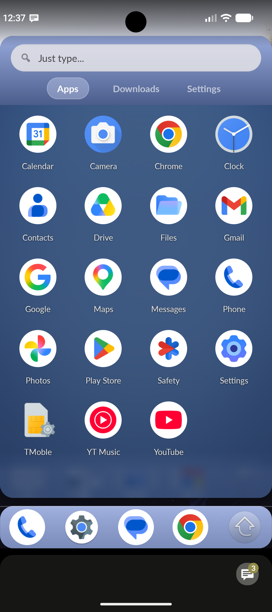
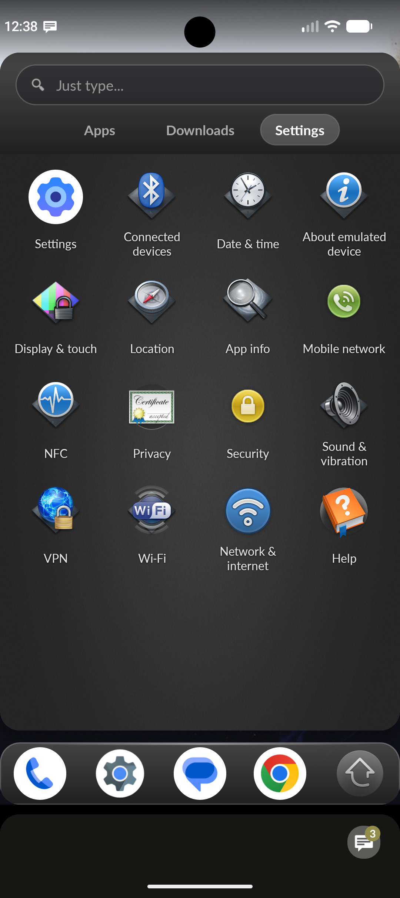
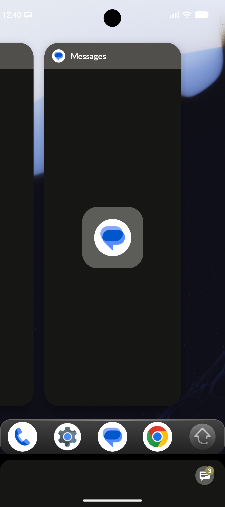
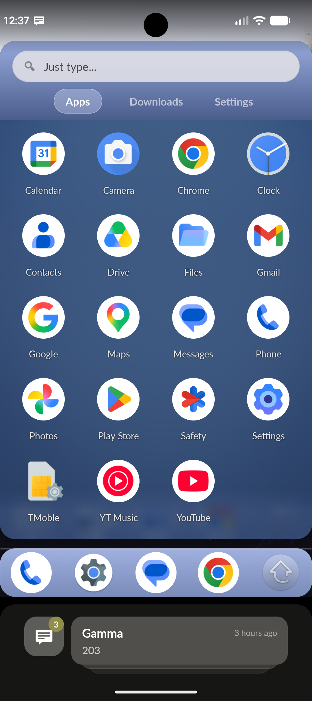
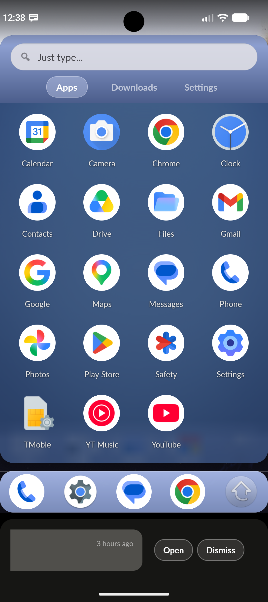

# W Launcher
Fast and lightweight launcher for Android inspired by Palm webOS.

<a href="https://play.google.com/store/apps/details?id=com.achunt.weboslauncher">W Launcher on Play Store</a>

## Screenshots

  
  
  
  
  
  

## Known bugs
* ~~Pressing back on home screen opens recent apps. We will call this one a feature.~~ This should be fixed.
* ~~LG phones launch wrong application when launching phone or messages from dock.~~ Fixed 3/22/2023

## Future Tasks

* ~~Adding the Just Type... functionality~~ Just Type... has been implemented as of 8/26/2022
* ~~App drawer separation of system and downloaded apps~~ Tab layout has been implemented as of
  8/29/2022
* ~~Settings in app drawer - Work in progress~~ Settings in app drawer as of 8/30/2022
* Allow dock to be customizable - ~~likely not going to be possible for a long time~~ In progress
* ~~Do better on the dock layout~~
* ~~Separate Just Type... feature~~

## Build Instructions

All the necessary files should be in place for loading into Android Studio and clicking build. This
project is built with Android Studio, so any other tools to build are not currently supported.
Minimum API is Android 8 (SDK ver 26) with a target of Android 15 (API 35/37). Gradle is used for
building.

## Commit History

9/22/2026 Version 3.5.0 is out! A comprehensive visual refresh honoring authentic Palm webOS 2.2.4 heritage — bundled open-source Lato typography, frosted glass Quick Launch dock with top specular highlight, "Just Type" real-time search bar with instant app filtering, Material 3 tonal pill tab indicators, 3-way theming (Material You dynamic system wallpaper colors, Classic Light, and Obsidian Dark), and an overhauled notification dashboard with 3D card stacking, gesture cycling, and action pills. See [RELEASE_NOTES.md](RELEASE_NOTES.md).

7/4/2026 Version 3.0 is out! A full webOS Mojo/Enyo visual overhaul — new Light/Dark themes, a
redesigned frosted-glass drawer and dock, long-press app actions, and W Launcher can finally be set
as your actual Home app. See [RELEASE_NOTES.md](RELEASE_NOTES.md) for the full rundown.

3/22/2023 Version 2.0 is out! This brings some small stability enhancements and a big new feature!
Recent apps are now displayed on the home screen as cards! Check out the release notes for more info!

2/10/2023 We are here! Pretty much everything I wanted to implement for a full on release has been
done. We have our first release, version 0.9.5! 0.9.5.1 will be a version with debug enabled just in
case there are any bugs discovered. I will be publishing to the Play Store soon and will publish a
link when it is uploaded.

1/2/2023 Happy New Year everyone! After working on this project some, I have decided that there will
be a change in the structure of this work. I will be splitting off Just Type development from the
launcher to make development easier and more focused. Lots of good changes are on the way! The
launcher will be more simplified, and Just Type will be getting lots more
features. https://github.com/achunt2143/Just-Type
Also, webOS Launcher is getting a name change to W Launcher to separate itself from webOS.

10/4/2022 Fixed the issue with JT not launching keyboard on start. Also added a contacts permission
request if it is not already granted. More updates to come!

8/31/2022 Some layout changes have been made and there is an about/help page for launcher.

8/30/2022 Settings in app drawer are functional. Icons have webOS look but will launch the intended
settings.

8/29/2022 System and Downloaded apps are now separated. Due to how Android handles flags on apps, it
is not perfect, but does a good job. Settings tab is there, and does pull some settings for launch,
but it is not finished.

8/29/2022 Just Type... had some bugs when calling or sending a text to a contact. There was a null
array error that would cause the launcher to crash. This should be fixed. Some errors also occurred
when searching that would cause the launcher to crash. This should also be fixed. This is a bug fix
commit. No new features have come yet.

8/26/2022 Just Type... is here! See release notes for more information about how it works.
Screenshots have been uploaded now to show the launcher. Multiple pages has been tough to figure
out, but that is next on the to-do list.

8/24/2022 My home button fix was not perfect. After testing on several different devices, sometimes
it would launch Gallery app and have no way to go home on my Samsung test devices. LG devices were a
mixed bag. Emulator worked just fine. This should be addressed. Some layout changes were also done
so things are properly centered and aligned. Dock background has been changed, as well as app drawer
page.

8/23/2022 Fixed a weird bug where launching phone when Samsung Level app is installed will launch
that instead of dialer. On press of home button now works to take user to home screen. Dock
background has been changed for debug purposes. This will be changed later.

8/19/2022 Some animations and layout issued have been adjusted. Dock icons now launch and close
appropriately. Some testing may need to be done on this still. Dock background may need to be
changed. App launcher will probably need to be its own activity moving forward to do some of the set
goals. App drawer is now the only issue.

8/13/2022 Added animations, fixed some formatting issues with icons, sorting apps alphabetically

8/12/2022 Project pushed to GitHub and all functions work
